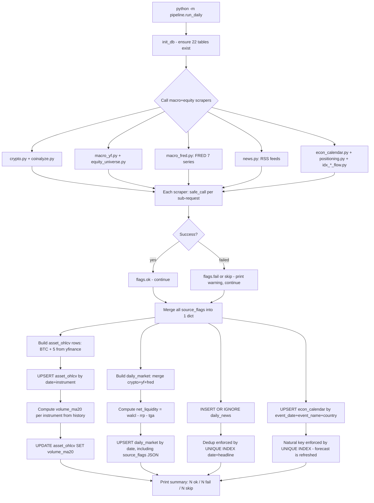
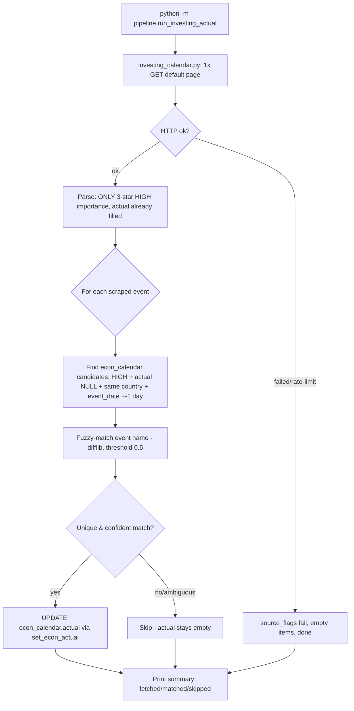
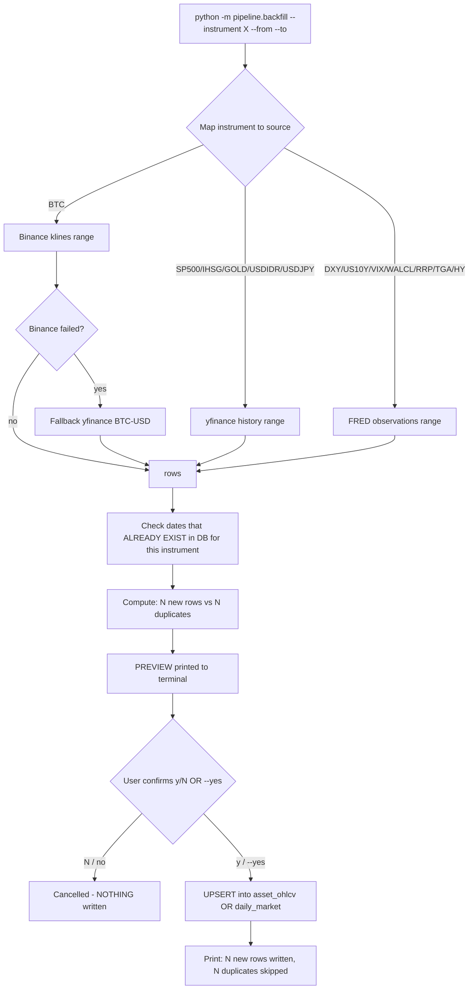
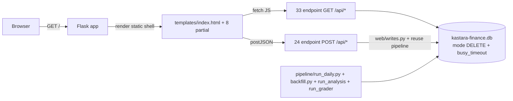
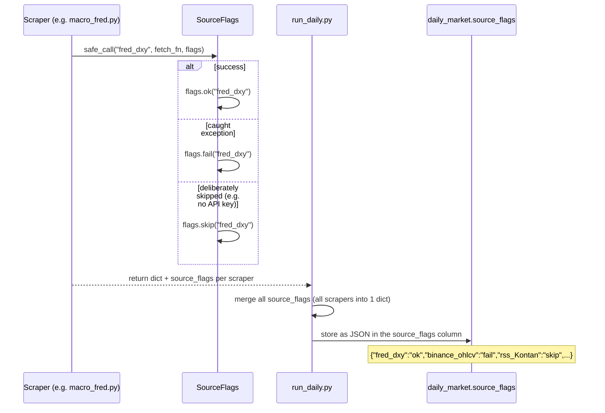

# Kastara Finance — Data Flow

> Companion to [ARCHITECTURE.md](ARCHITECTURE.md) (what & why) — this document
> focuses on **how data moves** through the system. Diagrams use Mermaid
> (renders automatically on GitHub/VS Code; if your viewer doesn't support it,
> read the text version in each section).

---

## 1. Daily Flow (`pipeline/run_daily.py`)

Run via **per-user crontab** `0 0 * * *` (system TZ is already WIB, see
README §5), or manually at any time.

> Note: the diagram below depicts the core of Phase A (5 macro scrapers). Since
> Phase D/J+ `run_daily` also calls `positioning.py` (COT+ETF), `coinalyze.py`
> (OI/liquidation), `idx_foreign_flow.py` + `idx_stock_foreign_flow.py` (IHSG &
> per-stock), and `equity_universe.py` (stock OHLCV) — identical pattern (`safe_call`
> → `source_flags` → merge), just adding branches, not changing the flow.

**Key points:**
- Stage C (calling scrapers) **never crashes** — each scraper catches
  internal errors via `safe_call`, so one dead API doesn't stop the
  others.
- The G→H order is intentional: `asset_ohlcv` is written first, then
  `volume_ma20` is computed from history (including today's row) and
  written back via `UPDATE`.
- Idempotent: running it twice for the same date → `UPSERT`/`INSERT OR IGNORE`
  produce the same end result (not duplicate rows). Already verified by tests.

---

## 1b. Evening/Night Flow (`pipeline/run_investing_actual.py`)

The SECOND cron, **separate** from the flow above (different schedule, not yet in
crontab — see README §5). Purpose: fill in `econ_calendar.actual` for HIGH-importance
events whose forecast/previous were already populated by the morning flow
(ForexFactory never provides `actual`, see
[ARCHITECTURE.md §6.14](ARCHITECTURE.md#614-scrapersinvesting_calendarpy--why-it-is-not-merged-into-run_daily)
for why this isn't simply added to `run_daily`).

**Key points:**
- DELIBERATELY conservative: ambiguous candidates (2+ equally high scores) are skipped,
  not guessed — better for `actual` to stay empty (fillable manually via
  the dashboard) than to attach it to the wrong event.
- Event-name normalization aligns terms between the 2 sources ("m/m" ForexFactory
  vs "(MoM)" investing.com become the same `mom` token) BEFORE stripping
  parentheses — if parentheses were stripped first, the MoM/YoY marker would be
  lost too and different events would look the same (found during live
  verification, see ARCHITECTURE.md §6.14).
- Never crashes, same `safe_call`/`source_flags` pattern as other scrapers.

---

## 2. Backfill Flow (`pipeline/backfill.py`)

Used manually to fill in history (e.g. 5 years back), bit by bit,
per instrument/range.

**Key points:**
- **Preview always shown before commit** — there's no path that writes
  without showing the preview first (except `--yes` for automation/testing, which still
  displays the preview, only skipping the prompt).
- Duplicates (`date`+`instrument` already exists) **are skipped, not errored** — safe
  to run repeatedly for overlapping ranges.
- Well suited to a "pull a little at a time" pattern: run per instrument, per
  range of a few months, repeatedly until 5 years are covered — no need to
  pull everything at once in one go.

---

## 3. Dashboard Flow (`web/app.py`, read **+ write** since Phase C)

**Key points:**
- Since Phase C the dashboard **reads AND writes**: manual input (journal,
  predictions, policy, intake, grade override, lane validation, etc.) via 24 POST
  endpoints. Writing still doesn't put new logic in the route — it reuses
  `web/writes.py` (pure, testable) + already-tested pipeline functions.
- The `/` route only renders a **static shell with no server-side data** — all content
  is fetched client-side from `/api/*` (a clean data boundary → the foundation for the
  FE migration to Vue, [migrationFE.md](migrationFE.md)).
- Still **single-writer in practice**: dashboard writes are brief & rarely
  concurrent with `run_daily`. **DELETE** mode + `busy_timeout=5000` (not
  WAL — [ARCHITECTURE.md §6.1](ARCHITECTURE.md#61-sqlite-vs-postgres-vs-nosql))
  keeps Windows↔WSL cross-access predictable.
- `/api/latest` parses the `source_flags` JSON into a render-ready structure
  (ok/fail/skip indicator dots in the UI).

---

## 4. Lifecycle of `source_flags`

This dict is an **audit trail** — used for debugging ("why is DXY empty
today?") and displayed directly on the dashboard as a per-source status indicator.

---

## 5. Summary of Who-Writes-What

| Component | Reads DB? | Writes DB? | Tables touched |
|---|---|---|---|
| `pipeline/run_daily.py` | yes (`volume_ma20`) | **yes** | `daily_market`, `asset_ohlcv`, `daily_news`, `econ_calendar`, `positioning` (COT/ETF/IHSG flow), `earnings_calendar` |
| `pipeline/run_investing_actual.py` (evening/night, separate) | yes (finds match candidates) | **yes** | `econ_calendar.actual` only (existing HIGH events, no new row insertion) |
| `pipeline/backfill*.py` | yes (checks duplicates) | **yes** | `asset_ohlcv`, `daily_market`, `fundamentals_quarterly`, `earnings_calendar` |
| `pipeline/run_analysis.py` | yes (history) | **yes** | `sr_zones`, `trade_signals` |
| `pipeline/run_grader.py` | yes | **yes** | `emiten_grade`, `grader_log` |
| `web/app.py` + `web/writes.py` (dashboard) | yes | **yes** (Phase C+) | manual input: `reading_workspace`, `trading_journal`, `prediction_log`, `expectations`, `policy_tracker`, `intake_log`, `instrument_metadata`, `emiten_grade` (override), `lane_validation_log`, `fundamentals_quarterly` (bank ratios), etc. |
| `indicators/calc.py` | yes (`volume_ma20_for_instrument`) | no | — |

Even though there are now more writers, in **practice it's still single-writer**:
`run_daily`/backfill/analysis/grader are run manually/via cron sequentially (not
in parallel), and dashboard writes are brief & rarely collide. If a real
parallel writer is needed later (e.g. multi-user after deployment), that's one
trigger to revisit SQLite → Postgres (see
[ARCHITECTURE.md §6.1](ARCHITECTURE.md#61-sqlite-vs-postgres-vs-nosql)).
