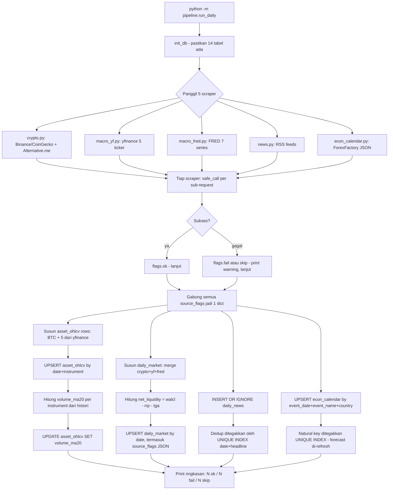
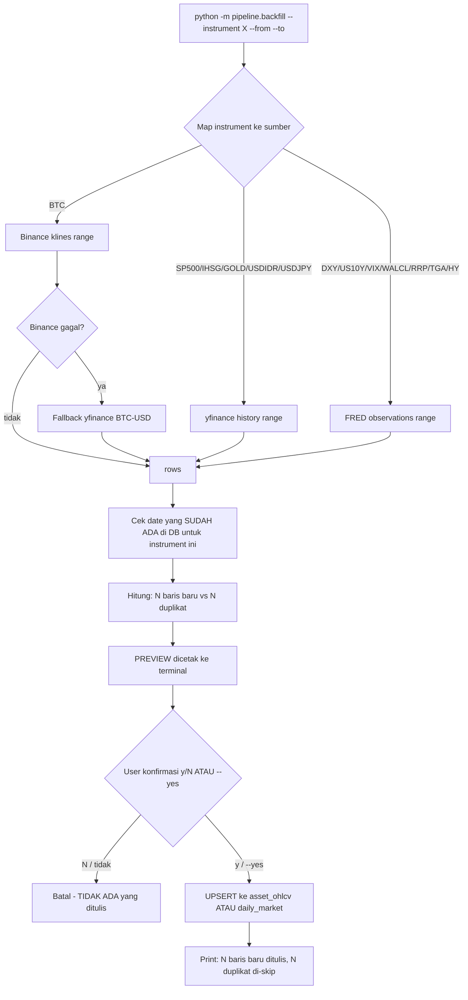
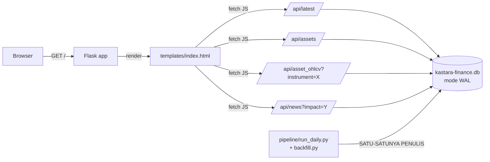
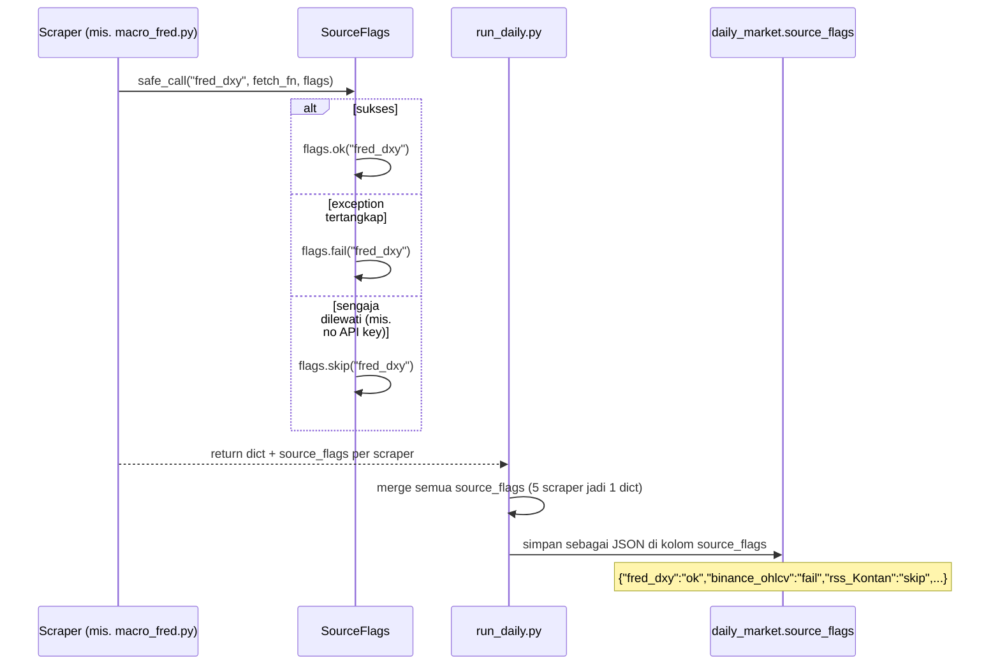

# Kastara Finance — Data Flow

> Pendamping [ARCHITECTURE.md](ARCHITECTURE.md) (apa & kenapa) — dokumen ini
> fokus ke **bagaimana data bergerak** lewat sistem. Diagram pakai Mermaid
> (render otomatis di GitHub/VS Code; kalau viewer tidak support, baca versi
> teks di tiap bagian).

---

## 1. Alur Harian (`pipeline/run_daily.py`)

Dijalankan via **crontab per-user** `0 0 * * *` (TZ sistem sudah WIB, lihat
README §5), atau manual kapan saja.

**Poin penting:**
- Tahap C (panggil scraper) **tidak pernah crash** — tiap scraper menangkap
  error internal via `safe_call`, jadi satu API mati tidak menghentikan yang
  lain.
- Tahap G→H urutannya sengaja: `asset_ohlcv` ditulis dulu, baru
  `volume_ma20` dihitung dari histori (termasuk baris hari ini) dan
  di-`UPDATE` kembali.
- Idempotent: jalan 2× untuk tanggal sama → `UPSERT`/`INSERT OR IGNORE`
  membuat hasil akhir sama (bukan baris ganda). Sudah diverifikasi test.

---

## 2. Alur Backfill (`pipeline/backfill.py`)

Dipakai manual untuk mengisi histori (mis. 5 tahun ke belakang), sedikit demi
sedikit per instrument/range.

**Poin penting:**
- **Preview selalu tampil sebelum commit** — tidak ada jalur yang menulis
  tanpa lihat preview dulu (kecuali `--yes` untuk automasi/testing, yang tetap
  menampilkan preview, hanya skip prompt-nya).
- Duplikat (`date`+`instrument` sudah ada) **di-skip, bukan error** — aman
  dijalankan berulang untuk range yang overlap.
- Cocok untuk pola "tarik sedikit-sedikit": jalankan per instrument, per
  range beberapa bulan, berkali-kali sampai 5 tahun tercakup — tidak perlu
  1 kali tarik semua sekaligus.

---

## 3. Alur Dashboard (`web/app.py`, read-only)

**Poin penting:**
- Dashboard **hanya membaca** (`SELECT`) — tidak ada endpoint yang menulis
  ke DB. Pipeline (dijalankan terpisah, manual/cron) tetap satu-satunya
  penulis.
- Mode **WAL** memungkinkan dashboard membaca *saat* pipeline sedang menulis,
  tanpa `SQLITE_BUSY`.
- `/api/latest` mengurai `source_flags` JSON jadi struktur siap-render
  (dot indikator ok/fail/skip di UI).

---

## 4. Siklus Hidup `source_flags`

Dict ini adalah **audit trail** — dipakai untuk debug ("kenapa DXY kosong hari
ini?") dan ditampilkan langsung di dashboard sebagai indikator status per
sumber.

---

## 5. Ringkasan Siapa-Menulis-Apa

| Komponen | Baca DB? | Tulis DB? | Tabel yang disentuh |
|---|---|---|---|
| `pipeline/run_daily.py` | ya (untuk `volume_ma20`) | **ya** | `daily_market`, `asset_ohlcv`, `daily_news`, `econ_calendar` |
| `pipeline/backfill.py` | ya (cek duplikat) | **ya** | `asset_ohlcv`, `daily_market` |
| `web/app.py` (dashboard) | ya | tidak | — (read-only semua) |
| `indicators/calc.py` | ya (`volume_ma20_for_instrument`) | tidak | — |

Tidak ada dua proses penulis yang berjalan bersamaan dalam desain saat ini
(single-writer). Kalau nanti butuh writer paralel, itu jadi salah satu
trigger untuk meninjau ulang SQLite → Postgres (lihat
[ARCHITECTURE.md §6.1](ARCHITECTURE.md#61-sqlite-vs-postgres-vs-nosql)).
